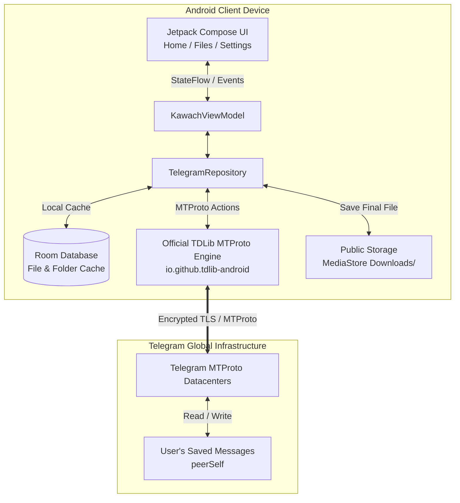

# 🛡️ Kawach Cloud

### *Secure Telegram Backend Storage*

[](https://android.com)
[](https://kotlinlang.org)
[](https://developer.android.com/jetpack/compose)
[](https://m3.material.io)
[](https://gradle.org)
[](https://github.com/GURUH4CK3R/Kawach_Cloud/actions)
[](LICENSE)
[](CHANGELOG.md)

**Kawach Cloud** is a modern, open-source Android cloud storage client designed to use your own **Telegram account and Saved Messages** as a private, high-capacity, serverless storage backend. 

Instead of routing your personal files through third-party servers or maintaining expensive developer-hosted cloud storage buckets, Kawach Cloud leverages the official **Telegram Database Library (TDLib)** to upload, organize, search, and download your files directly between your device and Telegram's distributed global infrastructure.

---

> [!NOTE]
> **Telegram Disclaimer:**  
> «Kawach Cloud is an independent project and is not affiliated with, endorsed by, sponsored by, or officially connected to Telegram.»

---

## 📌 Project Specifications

| Specification | Value |
| :--- | :--- |
| **Application Name** | **Kawach Cloud** |
| **Tagline** | Secure Telegram Backend Storage |
| **Current Version** | `1.0.0-alpha01` |
| **Build Number** | `1` (`versionCode = 1`) |
| **Release Status** | **Alpha** |
| **Minimum SDK** | `API 26` (Android 8.0 Oreo) |
| **Target / Compile SDK** | `API 36` (Android 15+) |
| **Language** | Kotlin `2.2.10` |
| **UI Framework** | Jetpack Compose + Material 3 |
| **Build Tool** | Gradle `9.3.1` (AGP `9.1.1`) |
| **JDK Requirement** | Java / JDK 17 or JDK 21 |
| **Developer** | **Aravind(guru)** |
| **Email** | `darkwebaccess404@gmail.com` |
| **Repository** | [https://github.com/GURUH4CK3R/Kawach_Cloud](https://github.com/GURUH4CK3R/Kawach_Cloud) |

---

## 💡 What Problem Does Kawach Cloud Solve?

1. **Third-Party Data Hoarding**: Traditional cloud providers store your personal files on their proprietary servers, subject to subscription paywalls, data harvesting, and sudden account closures.
2. **Clutter in Telegram Saved Messages**: Many people already use Telegram's "Saved Messages" as an ad-hoc drive, but Telegram chats lack folder hierarchies, file-size filters, sorting options, and dedicated cloud-drive ergonomics.
3. **No Heavy Scanning**: Kawach Cloud avoids treating your entire Telegram message history as a file list. Only files uploaded through Kawach Cloud receive a lightweight identifier and appear in the app, leaving your personal chats and notes untouched.

---

## 📸 Screenshots

> Screenshots can be captured on physical devices and placed in the [`screenshots/`](screenshots/) directory.

| Home Screen | Files Screen | Settings & Theme | Telegram Authentication |
| :---: | :---: | :---: | :---: |
|  |  |  |  |
| *Storage overview, category pills & quick upload* | *Folder chips, search, grid/list toggle & file cards* | *Light/Dark theme toggle & Telegram connection* | *Phone login, official Telegram OTP & 2FA challenge* |

*(Refer to [`screenshots/README.md`](screenshots/README.md) for capturing and contributing screenshots).*

---

## 🚀 Verified Feature Matrix

### ☁️ Cloud Storage & File Management
| Feature | Status | Description |
| :--- | :---: | :--- |
| **File Upload** | ✅ Implemented | Direct streaming to Telegram Saved Messages with live byte-level progress reporting via `TdApi.UpdateFile`. |
| **File Download** | ✅ Implemented | Real TDLib message-based download saved into Android's public `Downloads/` directory using modern `MediaStore.Downloads`. |
| **Safe Duplicate Handling** | ✅ Implemented | Prevents accidental overwrites using collision-safe file naming (`file (1).jpg`). |
| **File Opening & Sharing** | ✅ Implemented | View and share files with external applications via secure Android `FileProvider` content URIs. |
| **Permanent Deletion** | ✅ Implemented | Removes the message directly from Telegram Saved Messages and cleans up local database records. |
| **Custom Folder Creation** | ✅ Implemented | Create, view, and organize files into custom folders with local Room persistence and Telegram cloud metadata backup. |
| **Search & Filtering** | ✅ Implemented | Instant search by file name; category filtering (Images, Videos, Documents, Audio, Archives). |
| **Sorting** | ✅ Implemented | Sort files dynamically by Date (Newest/Oldest), Name (A-Z/Z-A), and Size (Largest/Smallest). |
| **Grid & List Views** | ✅ Implemented | One-tap toggle between detailed list view and responsive 2-column grid layout. |
| **Background Upload Service** | 🚧 In Progress | Continuing file uploads when the application is placed in the background. |
| **Client-Side Encryption** | 📋 Planned | End-to-end client envelope encryption before streaming files to Telegram. |

### 🔐 Telegram Authentication
| Feature | Status | Description |
| :--- | :---: | :--- |
| **Direct MTProto Protocol** | ✅ Implemented | Direct communication using official TDLib (`io.github.tdlib-android:core:0.1.1`). No intermediary servers. |
| **Phone Number Login** | ✅ Implemented | International phone input with preloaded country selector (defaulting to India `+91`). |
| **Official Telegram OTP** | ✅ Implemented | Secure login code delivery directly to your active official Telegram application. |
| **Two-Step Verification (2FA)** | ✅ Implemented | Full support for Telegram Cloud Password challenges. |
| **Session Persistence** | ✅ Implemented | Local session database maintained securely; seamless session restoration across app launches. |
| **Instant Logout** | ✅ Implemented | One-tap disconnection that clears session keys and resets the local file cache. |
| **Biometric App Lock** | 📋 Planned | Fingerprint and Face Unlock security gate prior to opening the application. |

### ⚡ Performance & File Indexing Architecture
| Feature | Status | Description |
| :--- | :---: | :--- |
| **Selective Kawach Indexing** | ✅ Implemented | Only files uploaded via Kawach are displayed. Does NOT scan or dump the user's personal Telegram chats. |
| **Signature Tagging** | ✅ Implemented | Files are tagged with `[KawachCloud] folder:<id> | id:<uuid> | #KawachCloud` in the message caption. |
| **Room Local Database Cache** | ✅ Implemented | Instant UI rendering with SQLite/Room caching; zero UI freezing on app startup. |
| **Coroutines & Reactive Flows** | ✅ Implemented | Heavy I/O and network operations executed off the main thread using Kotlin Coroutines (`Dispatchers.IO`). |
| **Telegram Deletion Sync** | ✅ Implemented | Active listener (`TdApi.UpdateDeleteMessages`) automatically purges locally cached files if deleted on Telegram. |
| **Resilient Re-Login Sync** | ✅ Implemented | Discovers existing Kawach files and custom folders upon re-login without loading unrelated messages. |

### 🎨 UI & User Experience
| Feature | Status | Description |
| :--- | :---: | :--- |
| **Jetpack Compose + Material 3** | ✅ Implemented | 100% modern declarative UI built with standard Material 3 design tokens. |
| **Dual Theme Support** | ✅ Implemented | System Default, Light Theme (`#F4F9FF`), and Dark Theme (`#07111F`) with seamless instant switching. |
| **Glassmorphic Components** | ✅ Implemented | Reusable `GlassCard` and `GlassButton` with contrast-adjusted borders and elevation. |
| **Storage Overview** | ✅ Implemented | Live breakdown of total cloud storage consumption and category counters. |
| **Upload & Download Feedback**| ✅ Implemented | Persistent progress indicators, percentage readouts, and cancellation handling. |

---

## 🏛️ System Architecture



### How Storage Works
1. **Upload**: You pick a file via Android's system picker. The file is copied to an isolated cache and streamed directly to your Telegram **"Saved Messages"** chat using `TdApi.SendMessage` with `TdApi.InputMessageDocument`.
2. **Metadata Tag**: A unique identifier is embedded in the message caption:
   ```text
   [KawachCloud] folder:<folderId> | id:<uuid> | #KawachCloud
   ```
3. **Indexing**: Kawach Cloud records the message ID, file name, MIME type, and folder ID in the local Room database (`FileEntity`).
4. **Download**: When tapping "Download", the real Telegram file is resolved by its Telegram message ID, downloaded through TDLib chunk streaming, and saved directly into the user's public `Downloads/` directory using modern Android `MediaStore`.
5. **Deletion**: Deleting a file in Kawach triggers a TDLib `DeleteMessages` call to remove the message from Telegram, followed by purging the local database entry and cached assets.

---

## 🔒 Security & Privacy Transparency

We believe in complete transparency. We do **NOT** make exaggerated claims of "100% unbreakable" or "zero-knowledge" security. Here is exactly how your data is handled:

- **No Intermediary Servers**: The application does **not** connect to any developer server, third-party database, or analytics tracker. All network connections are made directly from your phone to Telegram's official IP ranges over TLS/MTProto.
- **Credential Safety**: Telegram account passwords (2FA) and One-Time Passwords (OTP) are kept strictly in ephemeral device memory during the login handshake. They are never written to disk, SQLite, or log outputs.
- **Scope Limitation**: Files in Telegram Saved Messages are protected by Telegram's standard cloud-chat encryption (encrypted in transit and at rest on Telegram's server clusters). They are **not** end-to-end encrypted like Telegram Secret Chats. Telegram holds server keys required to sync cloud chat data across devices.
- **Client-Side Encryption (Roadmap)**: Client-side envelope encryption with user-held passphrase keys is on the project roadmap.
- **Read our full [PRIVACY.md](PRIVACY.md) and [SECURITY.md](SECURITY.md) policies.**

---

## 🛠️ Building from Source

### Prerequisites
- **Android Studio**: Android Studio Ladybug (2024.2.1+) or newer
- **JDK**: Java 17 or Java 21
- **Android SDK Platform**: SDK 36 (Minimum SDK: 26)

### Clone & Build
```bash
# 1. Clone the repository
git clone https://github.com/GURUH4CK3R/Kawach_Cloud.git
cd Kawach_Cloud

# 2. Configure environment credentials
cp .env.example .env
```

*(Optional)* You can supply your personal Telegram Developer API credentials from [my.telegram.org](https://my.telegram.org) inside `.env`:
```properties
TELEGRAM_API_ID=your_api_id
TELEGRAM_API_HASH=your_api_hash
```

```bash
# 3. Run unit tests
./gradlew testDebugUnitTest

# 4. Build the debug APK
./gradlew assembleDebug
```

The resulting APK will be generated at:
```text
app/build/outputs/apk/debug/app-debug.apk
```

---

## 🤖 Continuous Integration

Kawach Cloud uses **GitHub Actions** for continuous integration. Every push and pull request to `main` automatically runs unit tests, verifies the build, and packages the debug APK:

- **Workflow File**: [`.github/workflows/android.yml`](.github/workflows/android.yml)
- **Artifact Name**: `kawach-cloud-debug` (contains compiled debug APK)

---

## 🗺️ Project Roadmap

- [x] **v1.0.0-alpha01 Core Engine**:
  - [x] Official TDLib MTProto client integration
  - [x] International phone login, OTP, and 2FA authentication
  - [x] Upload files directly to Telegram Saved Messages
  - [x] Real message-based download to public `Downloads/` directory
  - [x] File deletion directly from Telegram and local cache
  - [x] Folder creation, deletion, and cloud metadata sync
  - [x] Light Theme (`#F4F9FF`) and Dark Theme (`#07111F`)
  - [x] Multi-user session isolation and clean logout
- [ ] **v1.1.0 Enhancements (In Progress 🚧)**:
  - [ ] Resilient background transfer service using Android WorkManager / Foreground Service
  - [ ] Video thumbnail generation and disk caching
  - [ ] File batch selection (multi-file download and delete)
- [ ] **v1.2.0 Security & Power Features (Planned 📋)**:
  - [ ] Client-side end-to-end file encryption (AES-256-GCM) with master passphrase
  - [ ] Biometric authentication lock (Fingerprint / Face Unlock)
  - [ ] Offline file pinning and favorites

---

## 👨‍💻 Developer & Contact

- **Lead Developer**: **Aravind(guru)**
- **Email**: [`darkwebaccess404@gmail.com`](mailto:darkwebaccess404@gmail.com)
- **GitHub**: [@GURUH4CK3R](https://github.com/GURUH4CK3R)
- **Repository**: [https://github.com/GURUH4CK3R/Kawach_Cloud](https://github.com/GURUH4CK3R/Kawach_Cloud)

---

## 📄 License

This project is open-source and distributed under the **Apache License 2.0**.  
See the [LICENSE](LICENSE) file for complete terms and conditions.

```text
Copyright 2026 Aravind(guru)

Licensed under the Apache License, Version 2.0 (the "License");
you may not use this file except in compliance with the License.
You may obtain a copy of the License at

    http://www.apache.org/licenses/LICENSE-2.0
```
