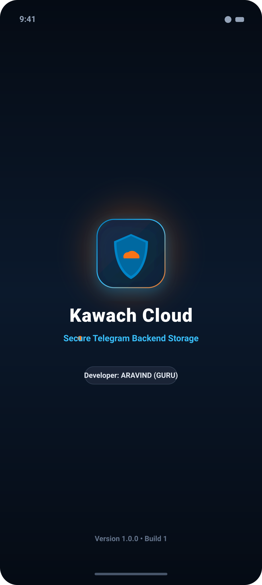
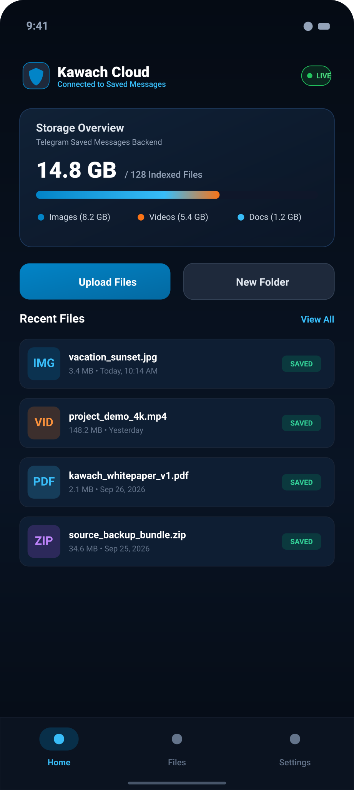
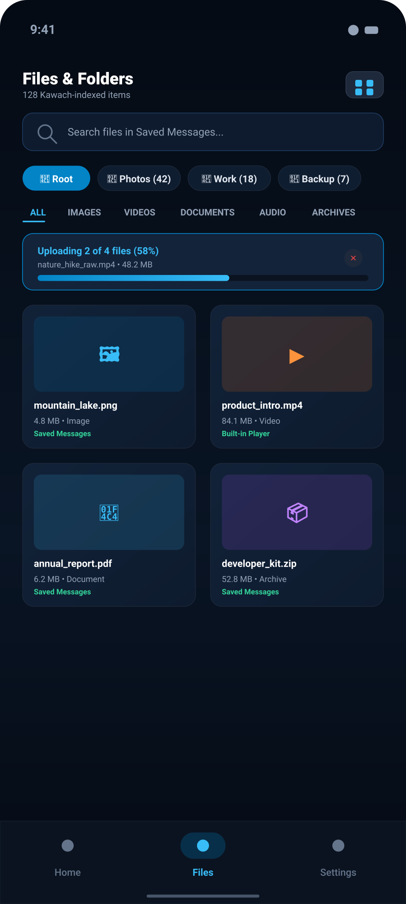
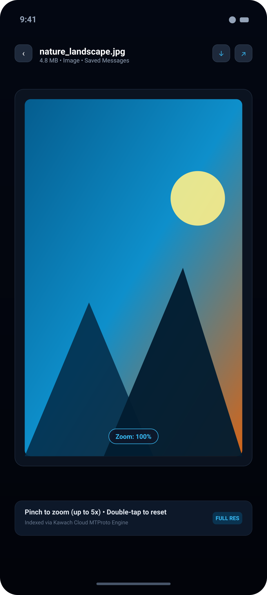
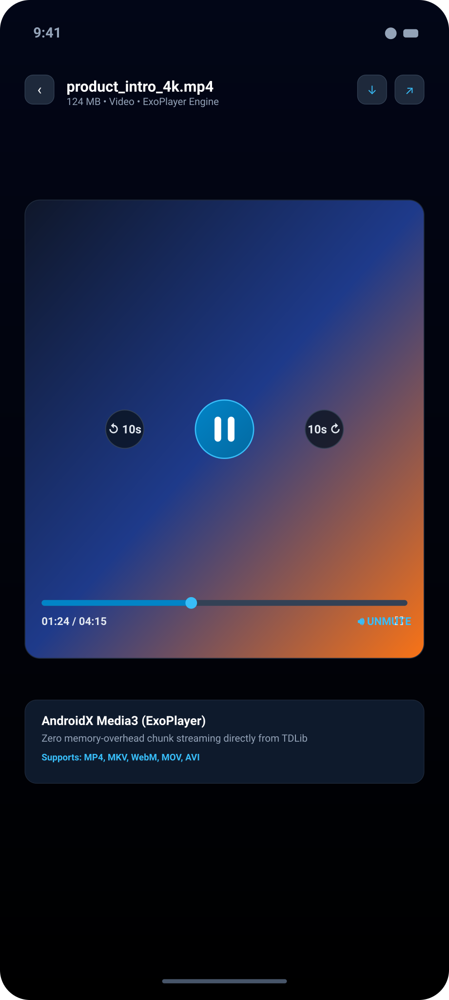
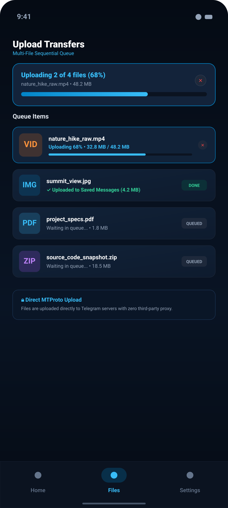
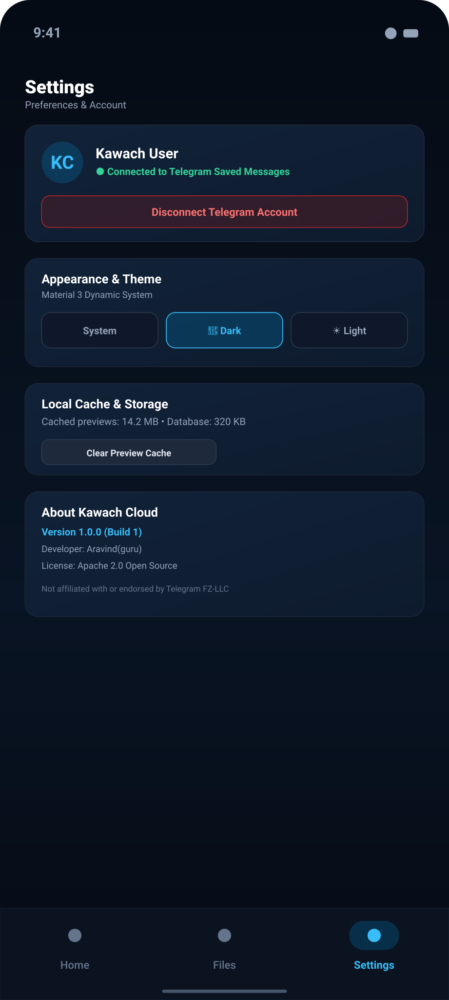
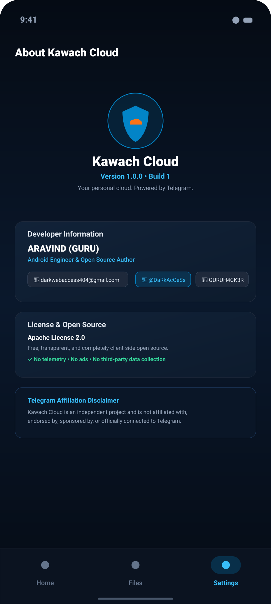

# 🛡️ Kawach Cloud

### *Your personal cloud. Powered by Telegram.*

 

  <b>Kawach Cloud</b> is a modern Android application that provides <b>free, unlimited personal cloud storage</b> by using your Telegram Saved Messages as the storage backend.

---

## 📱 App Preview

| Splash Screen | Home | Files | Image Preview |
| :---: | :---: | :---: | :---: |
|  |  |  |  |
| *Startup & Brand* | *Storage & Categories* | *Folders & Grid* | *Pinch-to-Zoom Viewer* |

 

| Video Player | Upload | Settings | About |
| :---: | :---: | :---: | :---: |
|  |  |  |  |
| *Built-in Player* | *Multi-File Queue* | *Theme & Account* | *App Details* |

---

## ✨ Features

- **Unlimited cloud storage** — Store unlimited personal files without subscription costs or total capacity caps, backed by Telegram's cloud (supports files up to 2 GB each, or 4 GB with Telegram Premium).
- **Telegram-powered file storage** — Sync and manage your documents, media, and archives directly in your Telegram Saved Messages.
- **Multiple file upload** — Select and upload multiple files at once with a real-time sequential progress queue.
- **File and folder management** — Organize your items into custom folders with quick navigation.
- **Image preview** — View photos inside the app with full-resolution pinch-to-zoom and pan support.
- **Video playback** — Watch videos directly with a smooth, built-in media player.
- **File download** — Download files directly to your device's public Downloads directory.
- **Search and sorting** — Instantly search files by name and sort by date, name, or file size.
- **Light and dark themes** — Clean Material 3 interface with full dark mode and light mode support.

---

## 📦 App Information

- **Version**: `1.0.0-alpha01`
- **Status**: `Alpha`
- **Storage Quota**: `Unlimited` (via Telegram Saved Messages)

---

## 🧑‍💻 Developer & Contact

### **LEAD DEVELOPER**
## **ARAVIND (GURU)**
*Android Engineer & Project Architect*

 

---

## Telegram

Kawach Cloud is an independent project and is not affiliated with, endorsed by, sponsored by, or officially connected to Telegram.
