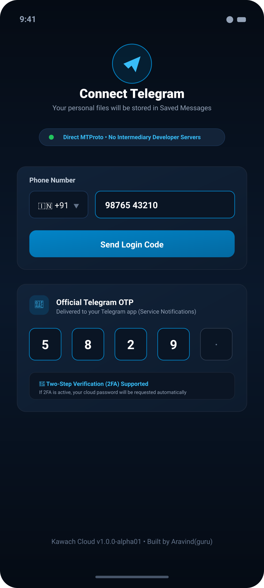

# 🛡️ Kawach Cloud

### *Secure Telegram-Backed Personal Cloud Storage for Android*

[](https://android.com)
[](https://github.com/GURUH4CK3R/Kawach_Cloud/releases)
[](https://github.com/GURUH4CK3R/Kawach_Cloud)
[](https://kotlinlang.org)
[](https://developer.android.com/jetpack/compose)
[](https://m3.material.io)
[](LICENSE)

**Kawach Cloud** is a modern, open-source Android cloud storage client that turns your own **Telegram account and Saved Messages** into a private, high-capacity, serverless personal cloud drive. 

Instead of routing your personal files through third-party servers or subscription cloud storage buckets, Kawach Cloud communicates directly with Telegram's global datacenters via the official **Telegram Database Library (TDLib)** to upload, organize, search, and download your files.

---

> [!NOTE]
> **Telegram Disclaimer:**  
> Kawach Cloud is an independent open-source project and is not affiliated with, endorsed by, sponsored by, or officially connected to Telegram FZ-LLC.

---

## 📱 Application Preview

| Startup Splash Screen | Home Dashboard | Files & Multi-Upload | Telegram Authentication |
| :---: | :---: | :---: | :---: |
|  |  |  |  |
| *Animated shield logo & brand startup* | *Live storage stats, category pills & recent files* | *Folder chips, multi-file queue & grid layout* | *Direct MTProto phone login, OTP & 2FA* |

---

## ✨ Features

- **Direct Telegram MTProto Connection**: Direct communication between your device and Telegram infrastructure using official TDLib (`io.github.tdlib-android:core:0.1.1`). No intermediary developer servers or proxy relays.
- **Selective Kawach Cloud Indexing**: Only files uploaded through Kawach Cloud with signature metadata (`[KawachCloud]`) appear in the app. Your personal Telegram chats, notes, and messages remain completely untouched and unindexed.
- **Multi-File Selection & Sequential Upload Queue**: Select single or multiple files in one action via Android's document picker (`ActivityResultContracts.GetMultipleContents`). Real-time byte progress reporting, cancellation, and error isolation.
- **In-App Photo Viewer**: Fullscreen image inspection supporting pinch-to-zoom (up to 5x), smooth pan gestures, double-tap zoom reset, and background media retrieval.
- **Built-In Video Player**: Integrated video playback powered by AndroidX Media3 (ExoPlayer), featuring play/pause, 10-second rewind/forward, duration slider, mute toggle, and fullscreen viewing.
- **Folder Organization & Search**: Create, rename, and manage custom folders. Instant file search by name and filtering by category (Images, Videos, Documents, Audio, Archives).
- **Public Downloads**: Download files directly to Android's public `Downloads/` directory using modern `MediaStore` with collision-safe duplicate naming (`file (1).ext`).
- **Real-Time Telegram Sync & Deletion**: Deleting a file removes the message from Telegram Saved Messages, cleans the local Room database, and evicts cached temporary files.
- **Material 3 Dual Theme**: Responsive UI designed with Material 3 tokens, featuring Light Theme (`#F4F9FF`), Dark Theme (`#07111F`), and System Default modes.

---

## 📋 App Specifications & Version

| Parameter | Value |
| :--- | :--- |
| **Application Name** | **Kawach Cloud** |
| **App Version** | **`v1.0.0-alpha01`** |
| **Build Number** | `1` (`versionCode = 1`) |
| **Release Status** | **Alpha** |
| **Minimum Android Version** | `Android 8.0` (API 26) |
| **Target / Compile SDK** | `Android 15+` (API 36) |
| **UI Framework** | Jetpack Compose + Material 3 |
| **Storage Backend** | Telegram Saved Messages (`peerSelf`) via TDLib |
| **Local Database** | Room Database (SQLite) |

---

## 👨‍💻 Developer & Contact

**Lead Developer**: **Aravind(guru)**

- 📧 **Email**: [`darkwebaccess404@gmail.com`](mailto:darkwebaccess404@gmail.com)
- 💬 **Telegram**: [https://t.me/DaRkAcCeSs](https://t.me/DaRkAcCeSs)
- 🐙 **GitHub**: [@GURUH4CK3R](https://github.com/GURUH4CK3R)
- 📦 **Repository**: [https://github.com/GURUH4CK3R/Kawach_Cloud](https://github.com/GURUH4CK3R/Kawach_Cloud)

---

## 🔒 Security & Privacy Overview

- **Zero Third-Party Relays**: Network connections travel directly from your phone to Telegram's official IP ranges over TLS/MTProto.
- **No Telemetry or Ads**: Kawach Cloud contains zero tracking SDKs, analytics packages, or advertisements.
- **Ephemeral Authentication Data**: Your Telegram phone number, login OTP, and Two-Step Verification (2FA) password are kept solely in transient memory during the login handshake and are never saved to disk or logged.
- **Storage Scope**: Files are stored in your Telegram Saved Messages under Telegram's standard cloud chat security model (encrypted in transit and at rest on Telegram's server clusters).

For complete details, see [PRIVACY.md](PRIVACY.md) and [SECURITY.md](SECURITY.md).

---

## 📄 License

This project is open-source and licensed under the **Apache License 2.0**. See the [LICENSE](LICENSE) file for terms and conditions.

```text
Copyright 2026 Aravind(guru)

Licensed under the Apache License, Version 2.0 (the "License");
you may not use this file except in compliance with the License.
You may obtain a copy of the License at

    http://www.apache.org/licenses/LICENSE-2.0
```
